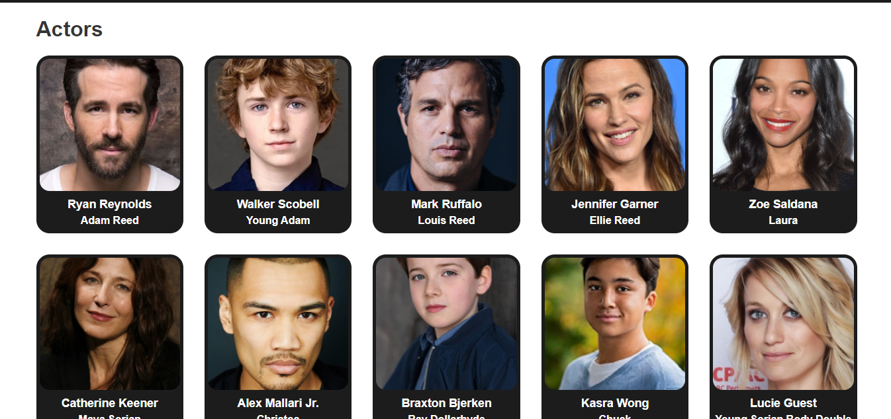

# RMDB
This is a movie website. It is a single page application. Consuming [The Movie Database API](https://developers.themoviedb.org/)
to display popular movies.
The purpose of this project is to showcase the use [React.js](https://reactjs.org/) framework including other libraries.

## Technologies used
- [React.js](https://reactjs.org/) - Frontend framework
- [React-router-dom](https://reacttraining.com/react-router/web/api/Link) - Router
- [Styled-components](https://styled-components.com/) (for styling)
- [Typescript](https://www.typescriptlang.org/) (for type checking)

## Screenshots

## Live demo
[Live demo](https://movies-rmdb.netlify.app/)

